## This is me :)

Hi, I'm **Milioan**, a technical builder who's obsessed with building real products that can make people's lives better.

I think **product first**, then choose the right tech stack to turn the idea into something real, useful, and production-ready.

🚀 **Currently building Brisk** — a platform for freelancers, solopreneurs, and small-to-medium businesses to create and manage invoices on demand.

🧪 **Next projects:** pending...

## The tools I build with

  
  &nbsp;&nbsp;
  
  &nbsp;&nbsp;
  
  &nbsp;&nbsp;
  
  &nbsp;&nbsp;
  
  &nbsp;&nbsp;
  
  &nbsp;&nbsp;
  
  &nbsp;&nbsp;
  
  &nbsp;&nbsp;
  

  
  &nbsp;&nbsp;
  
  &nbsp;&nbsp;
  
  &nbsp;&nbsp;
  
  &nbsp;&nbsp;
  
  &nbsp;&nbsp;
  
  &nbsp;&nbsp;
  
  &nbsp;&nbsp;
  
  &nbsp;&nbsp;
  

  
  &nbsp;&nbsp;
  
  &nbsp;&nbsp;
  
  &nbsp;&nbsp;
  
  &nbsp;&nbsp;
  

